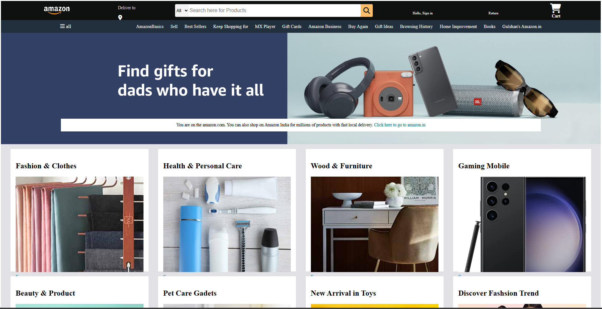

# AmazonClone
E-commerce Website (Amazon Clone) Built with HTML, CSS, and JavaScript. Features product search, user reviews, and order tracking. Demonstrates full-stack development capabilities.

# 🛒 Amazon Clone - E-commerce Website

A fully responsive Amazon-inspired e-commerce website built using **HTML**, **CSS**, and **JavaScript**. This project mimics core functionalities of a modern e-commerce platform including product listings, search functionality, user reviews (UI), and order tracking (UI).

## 🚀 Live Demo

[🔗 View Demo (GitHub Pages)](https://ankitkrg9.github.io/amazon-clone/)  
*(Replace with your actual link once hosted)*

---

## 📌 Features

✅ Modern Amazon-style UI  
✅ Product cards with images, prices, and descriptions  
✅ Responsive design for mobile, tablet, and desktop  
✅ Product **search bar**  
✅ **User reviews** section per product (UI only)  
✅ **Order tracking** page/interface (UI only)  
✅ Hover effects and interactive buttons using JavaScript  
✅ Modular and maintainable code structure

---

## 🛠️ Technologies Used

- **HTML5** – semantic structure of web pages  
- **CSS3** – responsive layout, Flexbox & Grid, animations  
- **Vanilla JavaScript** – interactivity (menu toggle, search filter, etc.)

---

## 📸 Screenshots
### 🏠 Home Page

🎯 Future Improvements
This is a frontend-only clone. Future enhancements may include:

Backend integration using Node.js or Django

Shopping cart functionality

User login & signup authentication

Add-to-cart and checkout flow

Database integration for products and reviews

Payment gateway (Stripe, Razorpay, etc.)

## 🙋‍♂️ Author

**Ankit Kumar**  
📧 [ank.1234321kit@gmail.com](mailto:ank.1234321kit@gmail.com)  
🌐 [Portfolio](https://ankit-portfolio-krg9.netlify.app)  
🐙 [GitHub](https://github.com/ankitkrg9)  
🔗 [LinkedIn](https://linkedin.com/in/ankitkrg9)
